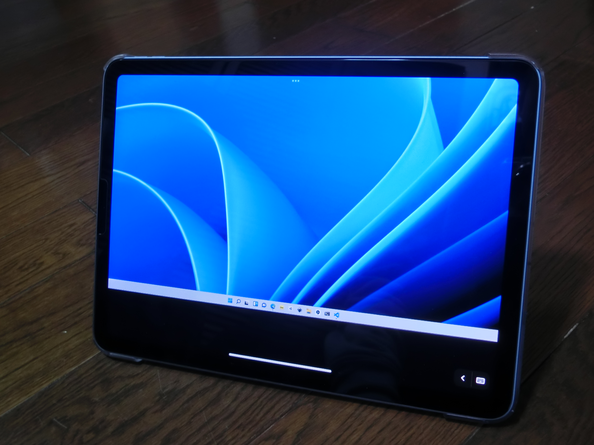

+++
title = "モバイルでPC操作してみよう！！！"
date = "2021-12-31"
slug = "mobile-pc-remote"
image = "remote.png"
description = "最後には告知も！！！"
categories = [
    "デジタル"
    "プログラミング"
]
tags = [
    "パソコン"
    "スマホ"
    "iPhone・iPad"
]
+++

こんにちは。ぺぬです。

みなさんデスクで作業するの辛くないですか？？

同じところにずっと座り続け、気づけば外は暗い。

私は辛いです。耐えられません。

そんな私と皆さんにお勧めできる方法があります。

**PCを遠隔で操作してみましょう！！**

## リモートアクセスのアプリ

PCを遠隔で操作、つまりリモートアクセスするアプリはいろいろあって、

どれが一番いい！っていうのはあまりありません。いろいろなサイトを参考にして選ぶといいと思います。

モバイルで操作するのでPCとモバイル側の2つにアプリを入れます。

私は今回「splashtop」というアプリを選びました。ほかのアプリよりなかなか遅延が少ないですからね(体感)。

## 問題

PCがモバイルで動くのって素敵ですよね。

でもいくつか問題はあります。

### UIが操作しづらい

モバイル用に設計されているUIではないため、操作はしづらいです。

最近はWindowsとかでもタブレットモードが進化してるみたいなので

次第に良くなることを期待します。

## 遅延が気になる

これは仕方ないですね。

どうしても遅延は出ます。

有線でもできるアプリはあるので気になりすぎる方はそちらがいいと思います。

**まとめ**

***どうしてもって人は試してください！！***

以上です。ぺぬでした。

今年はこの記事で最後です。よい年末年始をお過ごしください。

## 告知（宣伝？）

2021年に私が作った動画を一本にまとめました。

12/31 23:59より開始です。

カウントダウンも含めていますのでぜひご覧ください。


